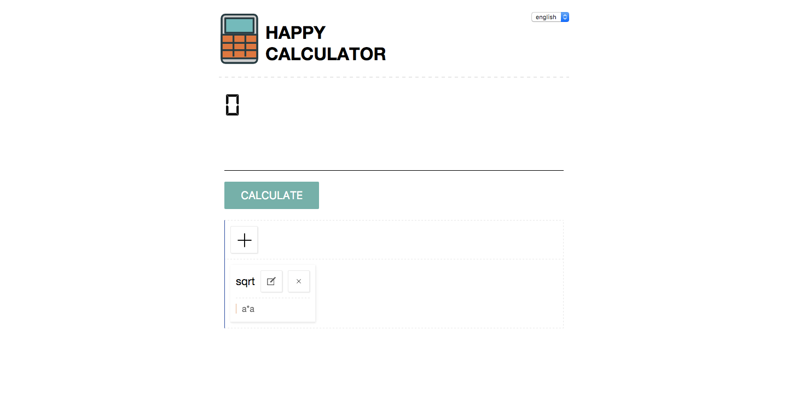

# happycalculator-application
a advance calculator that core code with happycalculator,build with react redux [billyct.github.io/happycalculator](http://billyct.github.io/happycalculator)



##Development
```bash
$ git clone https://github.com/billyct/happycalculator-application.git
$ cd happycalculator-application
$ npm install
$ gulp
```

##Fetures

* you can add your custom formulas,and calculate it when you put your number into the formulas
* also it's a culculator support ()+-*/,that [happycalculator](http://github.com/billyct/happycalculator) support
* localstorage


